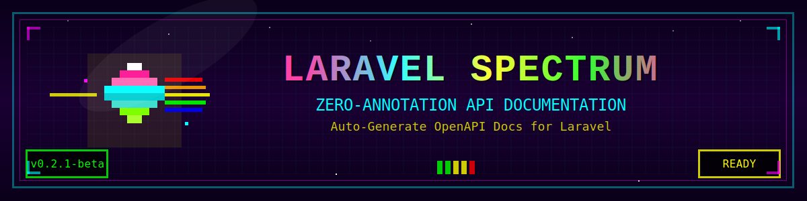

# Laravel Spectrum

<p align="center">
  
</p>

<p align="center">
  
</p>

[](https://github.com/wadakatu/laravel-spectrum/actions)
[](https://codecov.io/gh/wadakatu/laravel-spectrum)
[](https://packagist.org/packages/wadakatu/laravel-spectrum)
[](https://packagist.org/packages/wadakatu/laravel-spectrum)
[](https://packagist.org/packages/wadakatu/laravel-spectrum)
[](https://packagist.org/packages/wadakatu/laravel-spectrum)

> 🎯 **Zero-annotation API documentation generator for Laravel & Lumen**
> 
> Transform your existing Laravel/Lumen APIs into comprehensive OpenAPI 3.0 documentation without writing a single annotation or modifying your code.

## 🌟 Why Laravel Spectrum?

**Stop writing documentation. Start generating it.**

Laravel Spectrum analyzes your existing code and automatically generates beautiful, accurate API documentation. No annotations, no manual updates, no hassle.

✅ **Save Hours** - No more manual documentation writing  
✅ **Always Up-to-Date** - Documentation that evolves with your code  
✅ **Zero Learning Curve** - Works with your existing Laravel/Lumen code  
✅ **Production Ready** - Battle-tested with real-world applications

## ✨ Key Features

### 🎯 Everything You Need, Nothing You Don't

<table width="100%">
<tr>
<td width="33%" valign="top">

<div align="center">
<h3>🚀 Zero Setup</h3>
</div>

**Just works out of the box**
- No annotations needed
- No configuration files
- No manual updates
- Instant documentation

</td>
<td width="33%" valign="top">

<div align="center">
<h3>🧠 Smart Detection</h3>
</div>

**Understands your code**
- FormRequest validation
- Inline validation rules
- API Resources mapping
- Fractal Transformers

</td>
<td width="33%" valign="top">

<div align="center">
<h3>⚡ Real-time Updates</h3>
</div>

**Live documentation preview**
- Hot reload on changes
- WebSocket updates
- Smart caching
- Instant regeneration

</td>
</tr>
</table>

### 📋 Comprehensive Feature Set

<table width="100%">
<tr>
<td width="50%" valign="top">

**📝 Request Analysis**
- ✅ FormRequest validation parsing
- ✅ Inline validation detection
- ✅ File upload handling
- ✅ Query parameter extraction
- ✅ Enum constraint support
- ✅ Nested array validation
- ✅ Conditional validation rules

</td>
<td width="50%" valign="top">

**📦 Response Handling**
- ✅ API Resources structure
- ✅ Fractal Transformer support
- ✅ Pagination detection
- ✅ Conditional attributes
- ✅ Nested resources
- ✅ Collection wrapping
- ✅ Realistic examples with Faker
- ✅ Custom example mapping

</td>
</tr>
<tr>
<td width="50%" valign="top">

**🔐 Security & Auth**
- ✅ Bearer Token (JWT/Sanctum)
- ✅ API Key authentication
- ✅ OAuth2 flow support
- ✅ Per-route security
- ✅ Custom middleware
- ✅ Global auth settings

</td>
<td width="50%" valign="top">

**🛡️ Error Documentation**
- ✅ Validation errors (422)
- ✅ Auth errors (401/403)
- ✅ Not found (404)
- ✅ Custom error formats
- ✅ Field-level messages
- ✅ Multiple response types

</td>
</tr>
</table>

### ⚡ Performance Optimization (New!)

<table width="100%">
<tr>
<td width="50%" valign="top">

**🚀 Optimized Generation**
- ✅ Chunk processing for memory efficiency
- ✅ Parallel processing with multi-core support
- ✅ Incremental generation (only changed routes)
- ✅ Smart dependency tracking
- ✅ Memory usage monitoring
- ✅ Automatic garbage collection

</td>
<td width="50%" valign="top">

**📊 Performance Gains**
- ✅ 90% faster generation for 1000+ routes
- ✅ 75% less memory usage
- ✅ Multi-core CPU utilization
- ✅ Real-time progress tracking
- ✅ Detailed performance statistics
- ✅ Configurable optimization levels

</td>
</tr>
</table>

### 📤 Export to Popular API Tools (New!)

<table width="100%">
<tr>
<td width="50%" valign="top">

**🔗 Postman Integration**
- ✅ Export to Postman Collection v2.1
- ✅ Automatic environment generation
- ✅ Pre-request scripts included
- ✅ Test scripts for validation
- ✅ Authentication presets
- ✅ Request examples with realistic data

</td>
<td width="50%" valign="top">

**🦊 Insomnia Integration**
- ✅ Export to Insomnia v4 format
- ✅ Workspace organization
- ✅ Environment configuration
- ✅ Request chaining support
- ✅ Git sync ready
- ✅ Folder structure by tags

</td>
</tr>
</table>


## 📊 Why Choose Laravel Spectrum?

### Compare with Other Solutions

| Feature | Laravel Spectrum | Swagger-PHP | L5-Swagger | Scribe |
|---------|-----------------|-------------|------------|---------|
| **Zero Annotations** | ✅ | ❌ | ❌ | ⚠️ Partial |
| **Auto-detect Validation** | ✅ | ❌ | ❌ | ✅ |
| **API Resources Support** | ✅ | ❌ | ❌ | ✅ |
| **Fractal Support** | ✅ | ❌ | ❌ | ❌ |
| **File Upload Detection** | ✅ | Manual | Manual | ✅ |
| **Query Param Detection** | ✅ | ❌ | ❌ | ⚠️ Limited |
| **Enum Support** | ✅ | Manual | Manual | ❌ |
| **Conditional Validation** | ✅ | ❌ | ❌ | ❌ |
| **Live Reload** | ✅ | ❌ | ❌ | ❌ |
| **Smart Caching** | ✅ | ❌ | ❌ | ❌ |
| **Pagination Detection** | ✅ | ❌ | ❌ | ✅ |
| **Postman Export** | ✅ | ❌ | ❌ | ✅ |
| **Insomnia Export** | ✅ | ❌ | ❌ | ❌ |
| **Smart Examples** | ✅ | ❌ | ❌ | ⚠️ Basic |
| **Setup Time** | < 1 min | Hours | Hours | Minutes |

### 🎯 Perfect For

- ✅ **Existing Projects** - Document your current API without any changes
- ✅ **Rapid Development** - Documentation that keeps up with your pace
- ✅ **Team Collaboration** - Everyone sees the same, accurate documentation
- ✅ **CI/CD Integration** - Generate docs as part of your build process
- ✅ **API-First Development** - Design by coding, not by writing YAML

## 🔧 Requirements

- **PHP** 8.1 or higher
- **Laravel** 10.x, 11.x, or 12.x / **Lumen** 10.x, 11.x, 12.x
- **Composer** 2.0 or higher

## 🚀 Getting Started

### 1. Install

```bash
composer require wadakatu/laravel-spectrum --dev
```

### 2. Generate Documentation

```bash
php artisan spectrum:generate
```

### 3. Live Preview (Development)

```bash
php artisan spectrum:watch
# Visit http://localhost:8080 to see your documentation
```

### 4. View Documentation

```html
<!-- Add to your blade template -->
<div id="swagger-ui"></div>
<script src="https://unpkg.com/swagger-ui-dist/swagger-ui-bundle.js"></script>
<script>
SwaggerUIBundle({
    url: "/storage/app/spectrum/openapi.json",
    dom_id: '#swagger-ui',
})
</script>
```

**That's it!** Your comprehensive API documentation is ready in seconds.

For advanced options and commands, see:
- [CLI Reference](./docs/cli-reference.md) - All available commands and options
- [Performance Guide](./docs/performance.md) - Optimized generation for large projects
- [Export Features](./docs/export.md) - Export to Postman/Insomnia

## 🎯 Advanced Features

### Conditional Validation Rules Support

Laravel Spectrum automatically detects and documents conditional validation rules in your FormRequest classes. This feature generates OpenAPI 3.0 `oneOf` schemas to accurately represent different validation scenarios based on HTTP methods or other conditions.

See the [Conditional Validation Documentation](./docs/conditional-validation.md) for detailed examples and supported patterns.

### Performance Optimization for Large Projects

Laravel Spectrum includes advanced performance optimizations designed for large-scale projects with hundreds or thousands of routes. The `spectrum:generate:optimized` command provides up to 90% faster generation with 75% less memory usage.

See the [Performance Optimization Guide](./docs/performance.md) for detailed usage and configuration options.

### Export to API Testing Tools

Laravel Spectrum can export your API documentation to popular API testing tools like Postman and Insomnia. This feature automatically converts your OpenAPI 3.0 documentation into tool-specific formats with authentication, examples, and test scripts.

See the [Export Features Documentation](./docs/export.md) for detailed usage and configuration options.


## 📚 Documentation

- **[Configuration Guide](./docs/configuration.md)** - Detailed configuration options
- **[Real-World Examples](./docs/examples.md)** - Practical examples and use cases
- **[Advanced Features](./docs/advanced-features.md)** - Advanced functionality
- **[Conditional Validation](./docs/conditional-validation.md)** - Conditional validation rules documentation
- **[Performance Optimization](./docs/performance.md)** - Performance optimization guide
- **[Export Features](./docs/export.md)** - Postman & Insomnia export guide
- **[Troubleshooting](./docs/troubleshooting.md)** - Common issues and solutions


## 🔧 Quick Troubleshooting

- **Routes not appearing?** Check route patterns in config match your routes
- **Validation not detected?** Ensure FormRequest is properly type-hinted
- **Need help?** See our [detailed troubleshooting guide](./docs/troubleshooting.md)

## 🤝 Contributing

We welcome contributions! Here's how you can help:

```bash
# 1. Fork and clone the repository
git clone https://github.com/wadakatu/laravel-spectrum.git
cd laravel-spectrum

# 2. Install dependencies
composer install

# 3. Run tests
composer test

# 4. Check code quality
composer analyze      # PHPStan analysis
composer format:fix   # Fix code style

# 5. Make your changes and submit a PR!
```

### Development Commands

- `composer test` - Run all tests
- `composer test-coverage` - Generate coverage report
- `composer analyze` - Run static analysis
- `composer format` - Check code style
- `composer format:fix` - Fix code style

## 📄 License

The MIT License (MIT). Please see [License File](LICENSE) for more information.

---

<p align="center">
  Made with ❤️ by <a href="https://github.com/wadakatu">Wadakatu</a>
  <br><br>
  <a href="https://github.com/wadakatu/laravel-spectrum">
    
  </a>
  &nbsp;&nbsp;
  <a href="https://twitter.com/intent/tweet?text=Check%20out%20Laravel%20Spectrum%20-%20Zero-annotation%20API%20documentation%20generator%20for%20Laravel!&url=https://github.com/wadakatu/laravel-spectrum">
    
  </a>
</p>