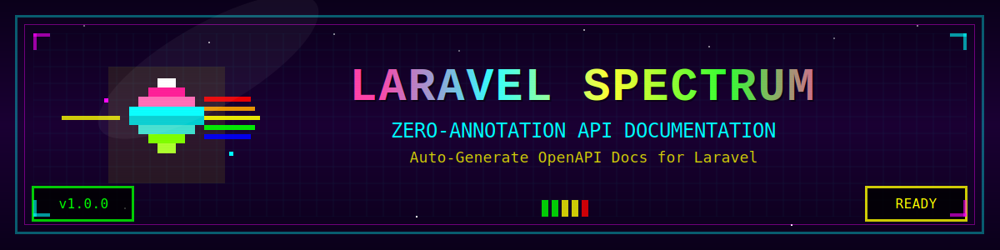

# Laravel Spectrum

<p align="center">
  
</p>

<p align="center">
  <a href="https://github.com/wadakatu/laravel-spectrum/actions"></a>
  <a href="https://codecov.io/gh/wadakatu/laravel-spectrum"></a>
  <a href="https://packagist.org/packages/wadakatu/laravel-spectrum"></a>
  <a href="https://packagist.org/packages/wadakatu/laravel-spectrum"></a>
  <a href="https://packagist.org/packages/wadakatu/laravel-spectrum"></a>
</p>

> 🎯 **Zero-annotation API documentation generator for Laravel**
>
> Laravel Spectrumは、既存のコードを解析して自動的にOpenAPI 3.0ドキュメントを生成します。アノテーション不要、設定最小限、すぐに使えます。

## ✨ なぜLaravel Spectrum？

**ドキュメントを書くのではなく、生成する。**

- 🚀 **ゼロ設定** - インストールしてコマンドを実行するだけ
- 🧠 **スマート検出** - FormRequest、バリデーション、APIリソースを自動解析
- ⚡ **リアルタイム更新** - コード変更を即座にドキュメントに反映
- 📤 **エクスポート機能** - PostmanやInsomniaへの直接エクスポート
- 🎭 **モックサーバー** - OpenAPIドキュメントから自動的にモックAPIを起動
- 🎯 **本番環境対応** - 大規模プロジェクトでも高速動作

## 🚀 クイックスタート

### 1. インストール

```bash
composer require wadakatu/laravel-spectrum --dev
```

### 2. ドキュメント生成

```bash
php artisan spectrum:generate
```

### 3. リアルタイムプレビュー（開発環境）

```bash
php artisan spectrum:watch
# http://localhost:8080 でドキュメントを確認
```

### 4. ブラウザで表示

```html
<!-- Bladeテンプレートに追加 -->
<div id="swagger-ui"></div>
<script src="https://unpkg.com/swagger-ui-dist/swagger-ui-bundle.js"></script>
<script>
SwaggerUIBundle({
    url: "/storage/app/spectrum/openapi.json",
    dom_id: '#swagger-ui',
})
</script>
```

### 5. モックサーバーを起動

```bash
php artisan spectrum:mock
# モックAPIサーバーが http://localhost:8081 で起動
```

**これだけです！** 数秒で包括的なAPIドキュメントが完成します。

## 📚 ドキュメント

詳細な使い方や高度な機能については、[日本語ドキュメント](./index.md)をご覧ください。

ドキュメントでは、以下のような内容をカバーしています：

- 🔧 **基本ガイド** - インストール、設定、基本的な使い方
- 🎯 **機能ガイド** - バリデーション検出、レスポンス解析、認証、モックサーバー
- ⚡ **高度な使い方** - パフォーマンス最適化、エクスポート機能、CI/CD統合
- 📖 **リファレンス** - CLIコマンド、設定項目、トラブルシューティング
- 🤝 **その他** - 他ツールとの比較、貢献ガイド

## 🤝 貢献

バグ報告、機能リクエスト、プルリクエストを歓迎します！詳しくは[貢献ガイド](./contributing.md)をご覧ください。

## 📄 ライセンス

Laravel SpectrumはMITライセンスのオープンソースソフトウェアです。詳細は[LICENSE](../../LICENSE)ファイルをご覧ください。

---

<p align="center">
  Made with ❤️ by <a href="https://github.com/wadakatu">Wadakatu</a>
  <br><br>
  <a href="https://github.com/wadakatu/laravel-spectrum">
    
  </a>
</p>